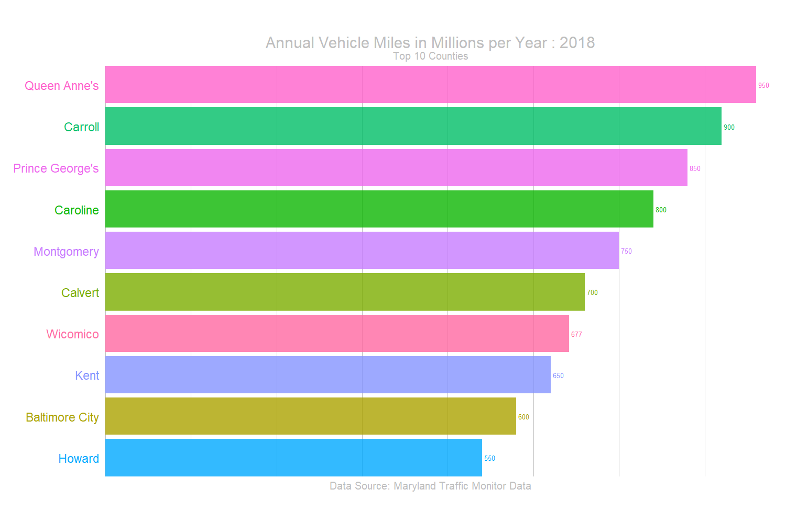

# animated_bar_charts_in_R

The goal of this project is explain how to build Animated Bar Charts in R (which is kinda trending on Social Media these days)

**Disclaimer:** The code used here is heavily borrowed (*You can say, inspired and copied*) from the answers of this Stack Overflow Question [Animated sorted bar chart with bars overtaking each other](https://stackoverflow.com/questions/53162821/animated-sorted-bar-chart-with-bars-overtaking-each-other)

### Potential Errors

If you faced this error `Error: The gifski package is required to use gifski_renderer`

Please install `gifski` and `png` package and try again.

### Final Output (GIF):

### Codes

+ `gdp_data_cleanup.R` - Cleaning up the data downloaded from WorldBank Data Site
+ `animated_bar_plot_in_R.R` - Building Animated Bar Plots 

### Reproducibility 

**Packages used**:

+ `gganimate`
+ `tidyverse`
